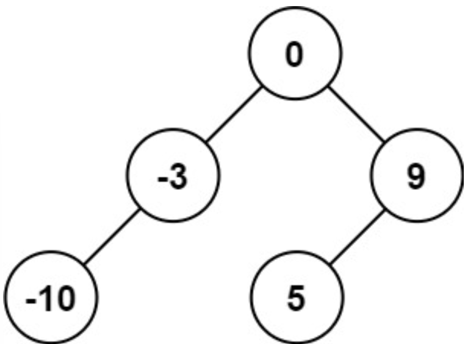
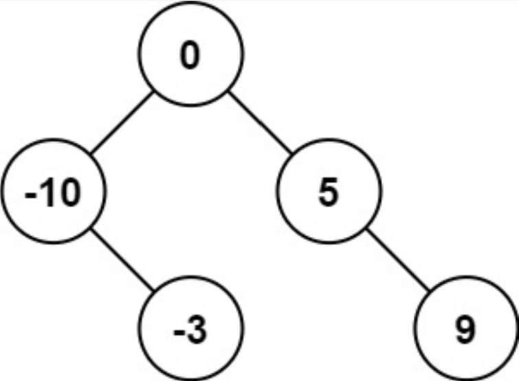
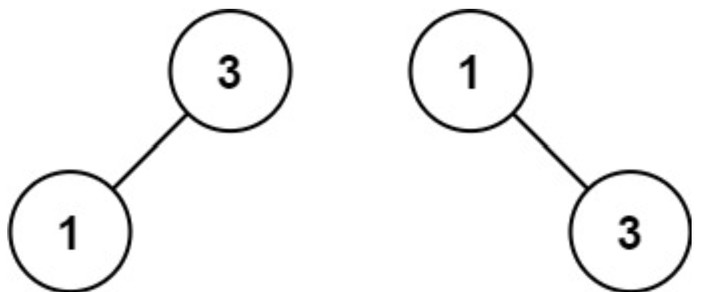

# [Convert Sorted Array to Binary Search Tree](https://leetcode.com/explore/interview/card/top-interview-questions-easy/94/trees/631/)
Given an integer array `nums` where the elements are sorted in **ascending order**, convert *it to a **height-balanced** binary search tree*.  
  
A **height-balanced** binary tree is a binary tree in which the depth of the two subtrees of every node never differs by more than one.

#### Example 1:


```
Input: nums = [-10,-3,0,5,9]
Output: [0,-3,9,-10,null,5]
Explanation: [0,-10,5,null,-3,null,9] is also accepted:
```


#### Example 2:


```
Input: nums = [1,3]
Output: [3,1]
Explanation: [1,null,3] and [3,1] are both height-balanced BSTs.
```

#### Constraints:
- `1 <= nums.length <= 10^4`
- `-10^4 <= nums[i] <= 10^4`
- `nums` is sorted in a **stricly increasing** order
