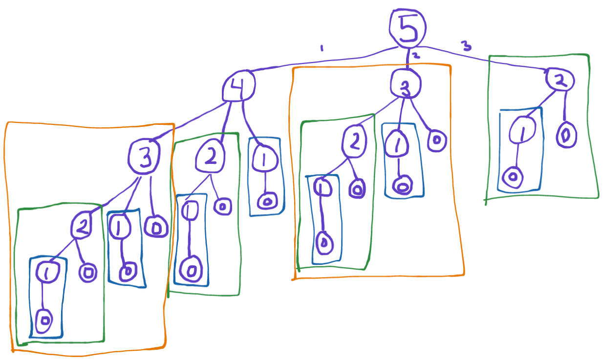

# [Climbing Stairs](https://leetcode.com/explore/interview/card/top-interview-questions-easy/97/dynamic-programming/569/)
You are climbing a staircase. It takes `n` steps to reach the top.  
  
Each time you can either climb `1` or `2` steps. In how many distinct ways can you climb to the top?

#### Example 1:
```
Input: n = 2
Output: 2
Explanation: There are two ways to climb to the top.
1. 1 step + 1 step
2. 2 steps
```

#### Example 2:
```
Input: n = 3
Output: 3
Explanation: There are three ways to climb to the top.
1. 1 step + 1 step + 1 step
2. 1 step + 2 steps
3. 2 steps + 1 step
```

#### Constraints:
- `1 <= n <= 45`

#### Follow up:
How could we extend our solution to accommodate if it were possible to take `1`,`2`, or `3` steps at a time?



As shown above, this is a modified Fibonacci series which contain distinct subproblems. To generate a solution, it may be more "natural" to devise the recursive solution since that would be **top-down** *(like this graph)*, and then extend it to the much faster iterative solution *(which would be **bottom-up**)*.
